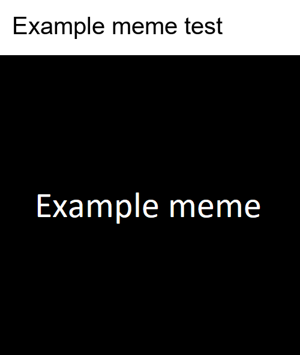
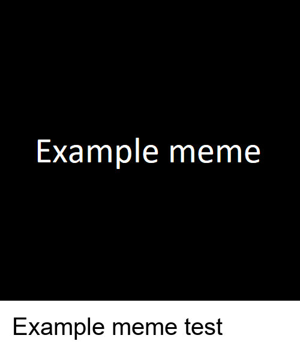
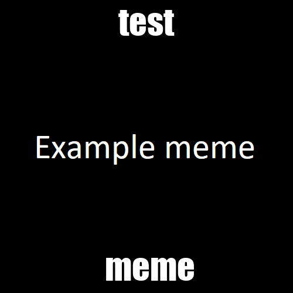

# MemeCLI
A CLI (Command Line Interface) based Meme Generator made in Python.

## Prerequisites
- [Python](https://www.python.org/)
- `pip install pillow`

## Usage
List of commands for the MemeCLI:
```
-h, --help                  Show help message
-i INPUT, --input INPUT     Input file to generate meme from.
-o OUTPUT, --output OUTPUT  Output file name to generate meme.
-t TYPE, --type TYPE        Type of meme. (1 - 3)
-s STRING --string STRING   Text/String to add to the meme.
-f FONT, --font FONT        Choose the font you want to use for the meme.
```

1. Put image in 'memes' folder
2. Use command line: `python main.py -i [input file name] -o [output file name] -t [meme type] -s [text/string to add to the image]`
3. Generated meme will appear in 'memes/exported' folder
Note: Avoid using pictures with 4k or a really small resolution. Needs fixing.

### Custom fonts (optional)
- Put font in 'fonts' folder
- Use the command line above and add: `-f [font name].ttf`

## Meme Types

<div>
  <div style='display: inline-block'>
    Type 1:  
    
  </div>

  <div style='display: inline-block'>
    Type 2:  
    
  </div>

  <div style='display: inline-block'>
    Type 3:  
    
  </div>
</div>

## Known bugs
- Long text goes outside of image (doesn't wrap).
- Font size is not equal in all images.
